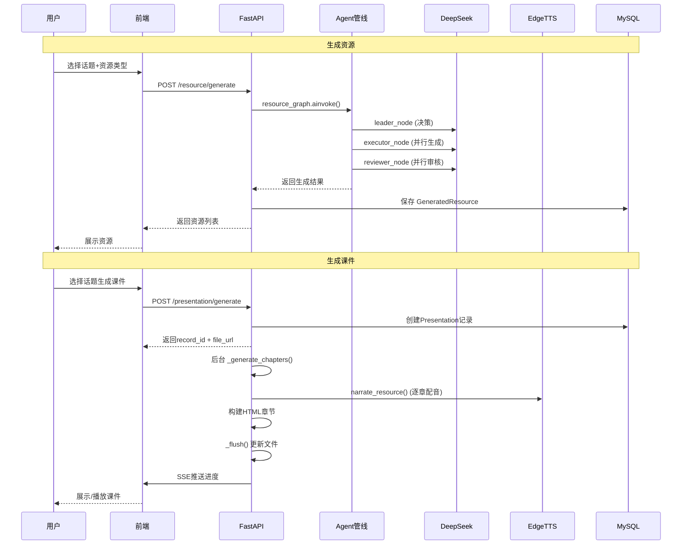

# 知伴 — 系统架构

```mermaid
flowchart TB
    subgraph Frontend["前端 Vue.js"]
        RC[ResourceCenter]
        PV[课件播放器<br/>独立HTML]
        LP[学习路径]
        CH[AI聊天]
        PET[小知宠物]
    end

    subgraph Gateway["API 层 FastAPI"]
        RR[/resource 路由]
        PR[/presentation 路由]
        VR[/video 路由]
        UR[/user 路由]
    end

    subgraph Graph["AI Agent 管线 LangGraph"]
        L[LeaderAgent<br/>需求分析<br/>决定资源类型]
        E[ExecutorAgent<br/>并行生成<br/>文档/PPT/思维导图/图片/习题]
        R[ReviewerAgent<br/>并行审核<br/>每类资源独立审查]
        L --> E --> R
        R -- 未通过(≤2次) --> E
    end

    subgraph Gen["生成服务"]
        LLM[DeepSeek LLM]
        TTS[EdgeTTS<br/>语音合成]
        IMG[讯飞星火<br/>图片生成]
        PPT[讯飞智文<br/>PPT生成]
    end

    subgraph Storage["存储"]
        DB[(MySQL<br/>Tortoise ORM)]
        AUDIO[音频文件<br/>static/audio/]
        HTML[课件文件<br/>static/presentations/]
        IMAGES[图片文件<br/>static/images/]
    end

    subgraph Pres["课件组装管线"]
        DIR[PresentationService<br/>逐章生成]
        SSE[SSE 实时推送<br/>生成进度]
        RENDER[HTML模板渲染<br/>蓝天白云+毛玻璃]
        DIR --> SSE
        DIR --> RENDER
    end

    %% 流程
    RC --> RR
    PV --> PR
    RR --> Graph
    Graph --> Gen
    Gen --> Storage
    Graph --> RR
    RR --> Pres
    Pres --> Gen
    Pres --> Storage
    PR --> Pres

    style L fill:#4f8cff,color:#fff
    style E fill:#a78bfa,color:#fff
    style R fill:#34d399,color:#fff
    style PET fill:#5BC8FF,color:#fff
    style TTS fill:#f59e0b,color:#fff
```

## 请求流程



## 目录结构

```
backend/src/
├── ai_core/              # AI 核心
│   ├── graph.py              LangGraph 编排
│   ├── agent.py              工具注册
│   ├── llm_config.py         LLM 配置
│   └── prompts/              提示词模板
│       ├── resource/             文档/PPT/思维导图/习题/图片
│       ├── agent/                Leader/Reviewer
│       └── presentation/         课件模板(template.html)
├── router/               # API 路由
│   ├── resource_router.py
│   ├── presentation_router.py
│   ├── video_router.py
│   ├── user_router.py
│   └── ...
├── service/              # 业务逻辑
│   ├── resource_service.py     资源管线入口
│   ├── presentation_service.py 课件生成
│   ├── narration_service.py    语音旁白
│   ├── image_service.py        图片生成
│   ├── ppt_service.py          PPT生成
│   └── ...
├── models/               # 数据模型 (Tortoise ORM)
├── utils/                # 工具
│   ├── tts_utils.py            EdgeTTS 工具
│   ├── mindmap.py              思维导图解析
│   └── ...
└── static/               # 生成文件(已ignore)
    ├── audio/
    ├── images/
    └── presentations/
```
